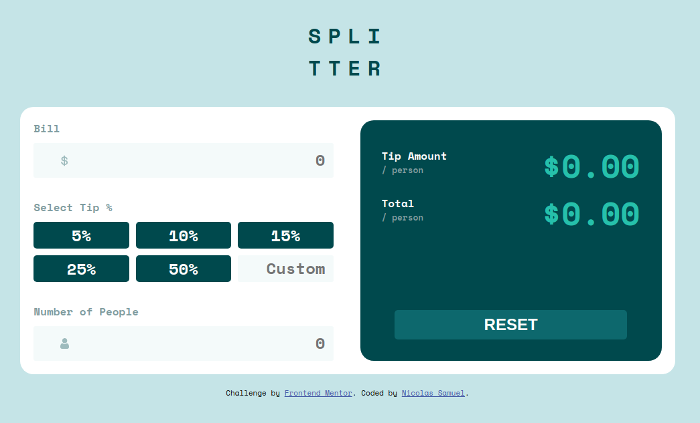

# Frontend Mentor - Tip calculator app solution

This is a solution to the [Tip calculator app challenge on Frontend Mentor](https://www.frontendmentor.io/challenges/tip-calculator-app-ugJNGbJUX). Frontend Mentor challenges help you improve your coding skills by building realistic projects.

## Table of contents

- [Overview](#overview)
  - [The challenge](#the-challenge)
  - [Screenshot](#screenshot)
  - [Links](#links)
- [My process](#my-process)
  - [Built with](#built-with)
  - [Useful resources](#useful-resources)
- [Author](#author)

### The challenge

Users should be able to:

- View the optimal layout for the app depending on their device's screen size
- See hover states for all interactive elements on the page
- Calculate the correct tip and total cost of the bill per person

### Screenshot

### Links

- Solution URL: [GitHub Project](https://github.com/nicolsam/tip-calculator-app-frontend-mentor/tree/main/public)
- Live Site URL: [Tip Calculator](https://tip-calculator-wheat.vercel.app/)

## My process

### Built with

- Semantic HTML5 markup
- CSS custom properties
- Flexbox
- CSS Grid
- SASS
- Mobile-first workflow
- Vanilla Javascript

### Useful resources

- [Arredondando um número decimal para um número decimal mais baixo](https://pt.stackoverflow.com/questions/78504/arredondando-um-n%C3%BAmero-decimal-para-um-n%C3%BAmero-decimal-mais-baixo) - Long decimal number to a shorter one
- [When 1 px border is added to div, Div size increases, Don't want to do that](https://stackoverflow.com/questions/3254587/when-1-px-border-is-added-to-div-div-size-increases-dont-want-to-do-that) - When input border is added, the input increases its size. This link helped me to avoid this problem.

## Author

- Frontend Mentor - [@nicolsam](https://www.frontendmentor.io/profile/nicolsam)
- Linkedin - [Nícolas Samuel](https://www.linkedin.com/in/n%C3%ADcolas-samuel-b025121a5/)
